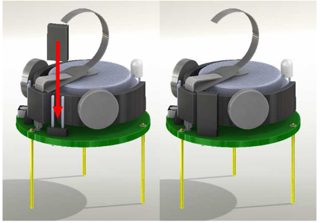
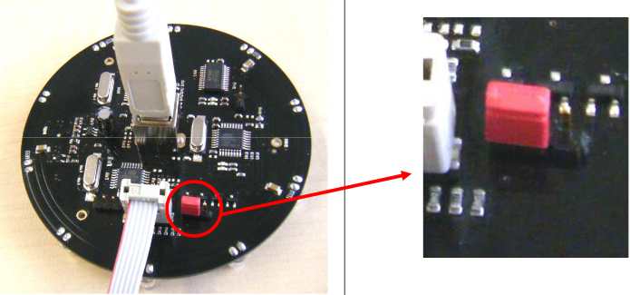

# kilobots Activity: simulating firefly synchronization

## Biological background

Fireflies are beetles that use flashes of light to attract females. In some species, males aggregate in large groups. These groups tend to synchronize their flashing. Here is some video of a North American species. When synchronized, the males produce a series of flashes. After this, they are simultaneously dark for a certain period before the flashing reoccurs:
[https://www.youtube.com/watch?v=EnwVVE-EGVw]()

Other species flash on and off in rapid succession, in synchrony:
[https://www.youtube.com/watch?v=xp3XKw5UwmY]()

Explaining these phenomena took scientists a long time, and initially, many people denied their existence altogether. Early on, people assumed some leader-follower relationship between beetles, thinking that beetles pay attention to a leader's flashing and that this triggered their own emission. However, now researchers hypothesize that each individual is a follower AND a leader. While there are probably differences between species in how they get synchronized, the general explanation is as follows.

Each beetle has an internal clock or cycle. Each time the clock reaches a particular phase, a flash is produced. Perceiving the flash of neighboring beetles advances or resets the clock cycle. In that way, each beetle uses the input from its local neighbors to adjust its own clock. Likewise, it also provides input to its neighbors.

Fireflies are now considered a classic example of self-organization in biology. The overall idea of self-organization is that order and organization can come about without central leadership or oversight but rather due to local interactions between many individuals. Other examples of self-organization include nest building in ants and flocking in birds. The phenomenon of firefly synchronization is also an example of a wider class of systems: coupled oscillators. This is discussed at the end of this lab session.

## Kilobot implementation

The kilobots have an onboard LED, which allows producing firefly-like flashes of light. However, robots cannot reliably perceive the flashes of others. The robots do have a light sensor that, in principle, could be used for this purpose. But the output of these sensors is too unreliable for this demonstration. Its value would depend mainly on the background lighting. Moreover, whether a flash is detected would depend on the relative orientation of the robots. Therefore, we will not use the light sensor in this demo. Instead, we will use the capacity of the robots to send IR messages to close neighbors.

The unreliability of the LED to light sensor communication forces us to use a different mechanism. The robots can be programmed to broadcast messages. When set, the robot will emit IR signals that close neighbors can pick up (up to about three body diameters). The rate at which the message is sent cannot be controlled directly and is scheduled independently by the controller.  Messages are sent at a rate of approximately 2 Hz. Conversely, robots can be programmed to listen to messages arriving. Again, looking for messages is scheduled by the controller. The manual states that the robot checks for receipt of messages about three times a second.

## Algorithm

The code works as follows (the square brackets refer to variable names in the code). 

+ Each robot's main loop is started after a random initial delay (see `setup` function). This maximizes the probability of the robots being initially desynchronized. 

+ After this, each robot starts its internal clock `counter`, counting up to `counter_max`, each step taking 20 ms `counter_delay`. This implies that each cycle, on average, takes `t` seconds, t  = (counter_max * counter_delay) / 100.


+ The value of `counter_max` is set after each pulse (See `flash` function) in the range `[counter_max_lower, counter_max_upper]`. This simulates the noise in the cycle interval of individual, isolated fireflies. 
+ While this cycle is running, the robot emits its clock state at a rate of 1000 /`counter_delay` Hz. Robots picking up this message calculate the difference `delay` between the received clock state and their clock. If their internal clock is ahead of the received clock, they reduce their clock by `correction_steps` steps.

# Working with the Kilobots

## Prepared experiments

The directory `KilobotRecordings` contains short videos documenting several experiments. These videos can be used to answer the questions below.

### Descriptions of videos

#### Experiment 01: Base case

These videos show 21 robots organized in a dense cluster. They run the default algorithm (see here: [https://github.com/ITEST-BME/kilobot_code]()).

#### Experiment 02 - 04: Varying cycle length

These videos show 21 robots organized in a dense cluster. They run the default algorithm. However, the length of the cycle of each robot varies from cycle to cycle. In other words, in isolation, each robot's flashing rhythm would differ slightly, and the rhythm would change from cycle to cycle. The variation in cycle length increases from batch 02 to 04.

#### Experiment 05 - 07: Varying group size

 For experiments 05-07, the algorithm used in the base case was restored. The cycle lengths of all robots were fixed to the same value. In these experiments, the group size was gradually reduced.

#### Experiment 08: Varying group shape

Experiment 08 shows the robots' behavior when laid out in a rectangle.

#### Experiment 09: Merging subgroups

This experiment observes what happens when the robots are initially separated into two isolated groups. A piece of board is placed between the groups to ensure they can not communicate. After the groups have synced, they are brought into contact.

### Questions based on the videos

Considering the videos as experimental data, please answer the following questions.

**Question 1: noise on the robots' internal cycles**

We saw that individual beetles have a "free-running rhythm." Solitary beetles flash at a steady pace. Some of the videos described have been recorded varying the internal cycle of the robot's flashing.  In particular, experiments 02 to 04 have increasing levels of noise on the individual robots' cycles. These three experiments can be compared with the base case in experiment 01, yielding four conditions in total.

+ (a) For each condition, determine the average it takes for the robots to attain synchronized flashing. If the robots do not achieve sync, this data point should not be included in the average.

+ (b) In addition to the average time to sync, determine how many times the robots successfully synchronize their flashing (i.e., success rate out of three trials).

+ (c) Formulate a 1-2 sentence conclusion based on the data you tabulated for (a) and (b).

**Question 2: group size**

Experiments 05 - 07 vary the group size. Use these clips to answer the following questions.

+ (a) Does the time to achieve synchronized flashing depend on the size of the group? 

+ (b) If so, do larger or smaller groups synchronize more quickly.

+ (c) Try and formulate a hypothesis about why the time to sync depends (not) on the group size.


**Question 3: group layout**

Experiment 08 changes the spatial layout of the robots. Compare the behavior in these clips with that of the base case (experiment 01).

+ (a) Formulate a 1-2 sentence conclusion about the effect of group shape on the robots' ability to achieve synchronization.

## Exercise examples

The following are a number of suggestions for designing additional exercises using the Kilobots. 

+ Injecting noise

For this experiment, you place a number of robots in close proximity. Measure the time it takes for robots to synchronize their flashing. You should try and alter the amount of noise on individual cycle lengths by editing the following lines of code. 

```c
int counter_max_lower = 95;
int counter_max_upper = 105;
```

Is there any level of noise beyond which synchronization does happen?

+ Subgroups

For this experiment, you separate two groups of robots by at least five body diameters. This prevents communication between the groups. Each group will synchronize internally. Once this is established, you could bring the groups closer together. Does the complete group manage to sync? 

+ Message delay

The signals fireflies use to synchronize (light flashes) travel almost instantaneously between individuals. However, other animals, such as some crickets, synchronize their behavior using acoustic signals. Over short distances, the delay between the emission and the reception of the signal will be short. However, as distance increases, the receiver will receive a time-delayed version of the emitted signal. This might interfere with the ability to synchronize clocks. 

Although the robots use light to communicate and can only communicate over short distances, we can simulate the effects of delayed reception of signals. To this end, you can comment and alter the line.

```c
int simulated_delay = 0;
```

This line of code simulates a delayed reception of the clock information of a neighbor. Observe whether robots achieve synchronization. What does failure or success tell you about the sensitivity of this system to delays?


## Compiling locally 

https://diode.group.shef.ac.uk/kilobots/index.php/Getting_Started:_How_to_work_with_kilobots

Compiling code is done as follows.

```
./compileCode.sh synced_flashing
```

## Compiling online

To run the code, you can use the online editor to compile it hex (https://www.kilobotics.com/editor). After this, you can upload and run the code as described here: [https://www.kilobotics.com/documentation]().  

Note: Jan 2021. I don't get this to work any longer.

## Hardware

### Charging

Each Kilobot has a built-in charger, which charges the onboard battery when 6 volts are applied to any of the legs, and GND is applied to the charging tab.

 


### Switching on/off

Turning the robots on is done by placing the power jumper as shown below.

 

### Using the programming wand

To program the robots, the wand should be in *normal mode*. The jumper should be in the position shown below.



Running the kilogui should be done as follows,`sudo kilogui ` and the programming of the robots requires these steps:

+ **Bootload**. LED turns blue.
+ **Upload**. LED flashed blue-yellow. Once the uploading is done, the LED flashes green.
+ **Run**

## Link to the API and manual

+ API: [https://www.kilobotics.com/docs/index.html]()
+ Manual: [http://ftp.k-team.com/kilobot/user_manual/old/Kilobot_UserManual.pdf]()
